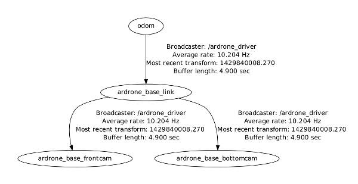

=================
Coordinate frames
=================

The driver publishes three `TF <http://www.ros.org/wiki/tf>`_ transforms between these frames: ``odom``, ``${base_prefix}_link``, ``${base_prefix}_frontcam`` and ``${tf_prefix}/${base_prefix}_bottomcam``. The `${base_link}` is the shared name prefix of all three reference frames and can also be set using :doc:`parameters`, by default it has the value of `ardrone_base`.

The `frame_id` field in header of all published topics (navdata, imu, cameras) will have the appropriate frame names. All frames are `ROS REP 103 <http://www.ros.org/reps/rep-0103.html>`_ compatible.
